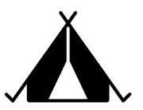

```{r global options, include=FALSE}
knitr::opts_chunk$set(warning = FALSE,message = FALSE)
```


```{r echo=FALSE, message=FALSE}
library(tidyverse)
library(httr)
library(plotly)
library(kableExtra)
```


```{r,results='hide',echo=FALSE}
res=GET('https://developer.nps.gov/api/v1/parks?limit=500&api_key=B9nDpbkbrb3kSOjz6kXSxMJ3d6MSpUvt1QqYdeyn')

data = res %>% content("text") %>% jsonlite::fromJSON() %>% as_tibble()
```

```{r, results='hide',echo=FALSE}
res=GET('https://developer.nps.gov/api/v1/thingstodo?limit=5000&api_key=B9nDpbkbrb3kSOjz6kXSxMJ3d6MSpUvt1QqYdeyn')

things_data = res %>% content("text") %>% jsonlite::fromJSON() %>% as_tibble()

things_data=things_data %>% unnest(data) %>% unnest(relatedParks,names_sep = "_") %>% unnest(activities,names_sep = "_")

clean_things=things_data %>% select(title,relatedParks_parkCode,latitude,longitude,isReservationRequired,arePetsPermittedWithRestrictions,activities_id,activities_name,doFeesApply,arePetsPermitted,season,timeOfDay) %>%
  mutate(relatedParks_parkCode=str_to_upper(relatedParks_parkCode),
           latitude=as.numeric(latitude),
         longitude=as.numeric(longitude),
         isReservationRequired=as.logical(isReservationRequired),
         doFeesApply=as.logical(doFeesApply))
```

```{r, results='hide',echo=FALSE}
NPS_data_parks=data %>% unnest(data) %>% select(fullName,parkCode,description,latitude,longitude,activities,states,entranceFees,operatingHours,designation) %>% unnest(activities,names_sep = '_') %>% unnest(entranceFees,names_sep = '_') %>% unnest(operatingHours,names_sep = '_') 

NPS_data_visits=read_csv('data/Query Builder for Public Use Statistics (1979 - Last Calendar Year).csv')

NPS_Full=NPS_data_parks %>%   mutate(entranceFees_cost=as.numeric(entranceFees_cost)) %>% 
mutate(parkCode=str_to_upper(parkCode))%>% full_join(NPS_data_visits,by=join_by('parkCode'=='UnitCode'))
```

    


There are many activities available to you when visiting a national park. Between all the parks there are `r NPS_Full %>% select(activities_name) %>% drop_na()%>% distinct %>% count()` unique activity categories. Ranging from `r NPS_Full %>% select(activities_name) %>% drop_na()%>% distinct %>% arrange(activities_name) %>% head(1)` to `r NPS_Full %>% select(activities_name) %>% drop_na()%>% distinct %>% arrange(activities_name) %>% tail(1)`. This range of activities bring millions of people to our national parks each year. This got us thinking, do the number of activities available at each park affect the level of visitation? We did some data analysis to find out. 

## Popular Activities

First lets look at all the activities available. Below is the list of activity categories from the National Park Services. 

```{r, include=TRUE}
NPS_Full %>% select(activities_name) %>% drop_na()%>% distinct %>% arrange(activities_name) %>% knitr::kable() %>% kable_styling() %>%
    scroll_box(width = "100%", height = "500px")
```


### Top Activities 
Now let's take a look at which activities are available at the most parks.
```{r, include=TRUE}
full_act=NPS_Full %>% select(parkCode,activities_name) %>% bind_rows(clean_things %>% select(relatedParks_parkCode,activities_name) %>% mutate(parkCode=relatedParks_parkCode)) %>% select(parkCode,activities_name) %>% distinct() %>% drop_na()


full_act%>% group_by(activities_name) %>% summarise(cnt=n_distinct(parkCode)) %>% mutate(activities_name=fct_reorder(activities_name,desc(cnt))) %>% top_n(10) %>%  ggplot(aes(x=activities_name,y=cnt))+geom_col()+theme(axis.text.x = element_text(angle = 90, vjust = 0.5, hjust=1))
```

Here are the top 10 most frequently available activities. All showing up in more than 100 different parks. The most popular activity being the Junior Ranger Program, a program focused on engaging with younger visitors. 

### Number of Activities at each Park
Let's look at it another way. Now let's take a look at the number of activities across the different parks. In other words how many different activity categories does each park have. 

```{r, include=TRUE}

full_act%>% group_by(parkCode) %>% count() %>% view()%>% ggplot(aes(x=parkCode,y=n))+geom_point()+theme(axis.text.x = element_text(angle = 90, vjust = 0.5, hjust=1))
```


Looks like there is quite a spread. With some parks as low as 1 and one with as many as 57 different categories. 

## Activities and Avg Visits

Because there are so many activities and such a wide range of availability, lets take a look at if the number of activities offered relates to the average visits to the park each month. 


```{r, include=TRUE}
NPS_Full %>%
  group_by(ParkName,parkCode) %>% 
  summarise(avg_visit=mean(RecreationVisits)) %>% full_join(full_act %>% group_by(parkCode) %>% count(),by='parkCode') %>% ggplot(aes(x=n,y=avg_visit))+geom_point()
```

This graph compares the number of activities to the average monthly visits.


Lets look further to see if there is a relationship between them. Using a linear model to see if average visit can be at all predicted by the number of activity catagories found at the park. 

```{r, include=TRUE}

NPS_Full %>%
  group_by(ParkName,parkCode) %>% 
  summarise(avg_visit=mean(RecreationVisits)) %>% full_join(full_act %>% group_by(parkCode) %>% count(),by='parkCode')%>%   lm(avg_visit~ n,data=.) %>% broom::tidy()
```


It looks like there is a significant relationship, lets add it to our graph.

```{r, include=TRUE}
NPS_Full %>%
  group_by(ParkName,parkCode) %>% 
  summarise(avg_visit=mean(RecreationVisits)) %>% full_join(full_act %>% group_by(parkCode) %>% count(),by='parkCode') %>% ggplot(aes(x=n,y=avg_visit))+geom_point()+stat_smooth(method = 'lm')
```

## Things to do 

As part of promotional material the NPS also has a list of things to do. These are specific programs, trails or events that a person might try at the park. They are categorized under the different activities listed above. We have a little more information about these activities. Below is a breakdown of some of the things that might effect participation.

```{r}

clean_things %>% 
  ggplot(aes(x=doFeesApply))+geom_bar()
clean_things %>% 
  ggplot(aes(x=isReservationRequired))+geom_bar()
clean_things %>% 
  ggplot(aes(x=arePetsPermitted))+geom_bar()

```

### Shiny App

In order to help people find these activities, we created a shiny app to help them find where these promoted things to do are based on the criteria they desire. The app can be found [HERE](https://mlachs.shinyapps.io/shiny_app/)